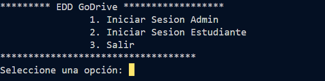
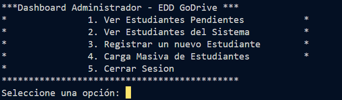
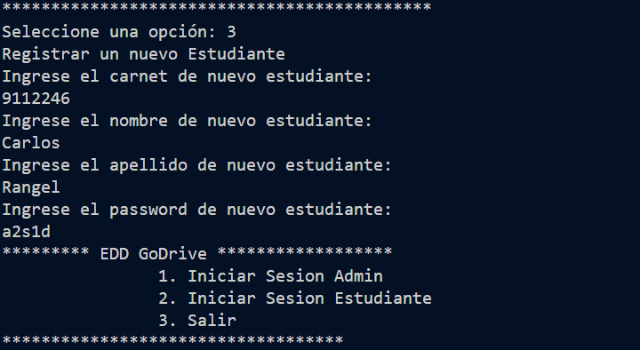
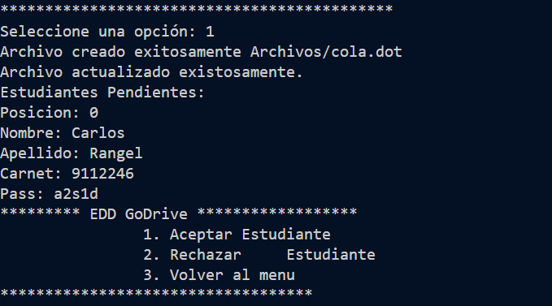
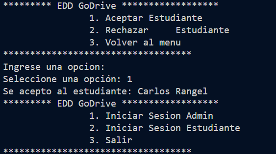

UNIVERSIDAD DE SAN CARLOS DE GUATEMALA

FACULTAD DE INGENIERIA

ESCUELA DE CIENCIAS Y SISTEMAS

ESTRUCTURA DE DATOS

PRIMER SEMESTRE 2023

---

---

---

---

---

---

---

 <h1>FASE #1</h1> 

---

---

---

---

Carlos Raul Rangel Robelo        9112246   

---

---

---

---

---

---

---

---

---

## Consola
Funcionamiento de la aplicacion en consola.

  

  

  

  

  

